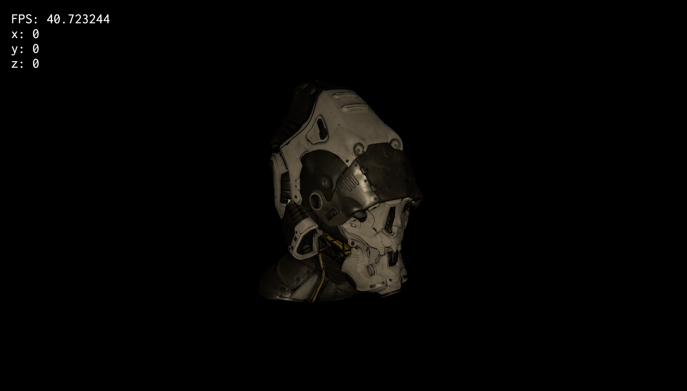

# wgpu-pbr

wgpu-pbr is a realtime physically-based renderer (PBR) intended for use in games. It is not a game engine - you will still need to handle input, build a game loop, fix your timestep, integrate with a physics engine, etc.

Credit is due to [rendy-pbr](https://github.com/termhn/rendy-pbr) and [Amethyst](https://github.com/amethyst/amethyst/blob/57a8a2345848e99c96c3d6fca13d952a367c1058/amethyst_rendy/shaders/), which the shaders are heavily derived from.

## Run the example

```
git clone https://github.com/tedsta/wgpu-pbr
cd wgpu-pbr
wget https://www.dropbox.com/s/5rl9ji77s3qnhdk/assets.zip
unzip assets.zip
cargo run --release --example scene_viewer
```

## Screenshots

[]()
[]()
[]()
[]()

## Features

- [x] PBR materials
    - base texture
    - normal map
    - metallic roughness
    - ambient occlusion
    - emissive
- [ ] Lights
    - [x] Point lights
    - [x] Spot lights
    - [ ] Directional lights
- [ ] HDR environment maps
- [ ] Bloom
- [ ] Shadows
- [ ] Skeletal animations
- Assets
    - [x] glTF
    - [x] Wavefront OBJ via tobj (with custom .mtl attributes for PBR materials)

# License

MIT

# Assets

SciFiHelmet and BoomBox models are from the glTF Samples repository. BoomBox was originally created by Microsoft and is licensed under the public domain. SciFiHelmet was created by Michael Pavlovich for Quixel and is licensed under the CC-Attrib 4.0 license.
